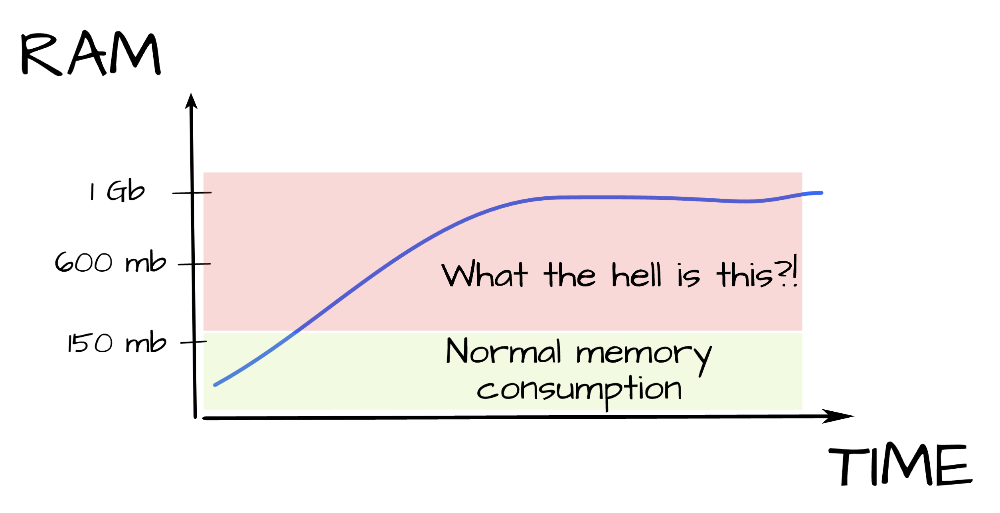

# Next Image Cache Cleaner

Next Image Cache Cleaner is a Node.js tool designed to manage and clean the image cache directory generated by Next.js.
It addresses a critical problem in production environments where uncontrolled inode allocation (for caching optimized
images) leads to excessive memory consumption. This, in turn, hinders accurate resource monitoring in containerized
applications.



---

## Features

- **Automated Cache Cleaning:**  
  Periodically scans the image cache directory and removes outdated or expired cache files.

- **Limit-Based Cleanup:**  
  Monitors the cache directory size and deletes the oldest files when usage exceeds a configurable limit (e.g., 80% of
  the allocated space).

- **Dual-Mode Operation:**  
  Supports both cron-based scheduling and file-watcher (using Chokidar) to trigger cleanups.

- **Optimized for Containerized Environments:**  
  Helps ensure that inode caching does not mask real memory consumption in Kubernetes and other container platforms.

## Usage

You can run the tool using npx:

```shell
npx next-image-cache-cleaner --fromEnv
```

You can also pass additional parameters via the CLI:

```shell
npx next-image-cache-cleaner --dir /path/to/.next/images --cron "*/5 * * * *" --size 1048576 --percent 0.8
```

The tool accepts configuration either from command-line options or environment variables:

- `NICC_CRON_CONFIG`: Cron string for scheduling cleanups.
- `NICC_IMAGE_CACHE_DIRECTORY`: Absolute path to the image cache directory.
- `NICC_MAX_CAPACITY`: Maximum allowed cache size (in bytes or kilobytes as configured).
- `NICC_FULLNESS_PERCENT`: Percentage threshold that triggers cleanup.
- `NICC_LOG_LEVEL`: Logger level (available values: `debug` | `info` | `error` | `silent`)

### With Docker

You can adopt this method also at Kubernetes deployment:

_compose.yml_

```yaml
services:
  nextjs-app:
    image: your-nextjs-app:latest
    container_name: nextjs-app
    ports:
      - '3000:3000'
    volumes:
      - image-cache:/app/.next/cache/images
    environment:
      NODE_ENV: production
    restart: always

  next-image-cache-cleaner:
    image: node:22.14.0-alpine3.21
    container_name: next-image-cache-cleaner
    volumes:
      - image-cache:/app/.next/cache/images
    environment:
      # Absolute path to image cache directory
      NICC_IMAGE_CACHE_DIRECTORY: /app/.next/cache/images
      # Cron string
      NICC_CRON_CONFIG: '*/5 * * * *'
      # Max folder size in Kb
      NICC_MAX_CAPACITY: '102400'
      # Fullness percent of cache directory
      NICC_FULLNESS_PERCENT: '0.8'
    restart: always
    command:
      - npx
      - next-image-cache-cleaner

volumes:
  image-cache:
```

## Configuration

- **Cron Mode:**
  The tool uses [node-cron](https://www.npmjs.com/package/node-cron) to schedule periodic cache cleaning tasks.
- **Limit Mode:**
  It monitors the directory size and, when the configured fullness percentage is exceeded, removes the oldest files to
  free up space.
- **Watcher Mode:**
  With [Chokidar](https://www.npmjs.com/package/chokidar), the tool listens for new files in the cache directory and
  triggers cleanup when necessary. Debouncing is applied to prevent excessive cleanups.

---

## Motivation

In recent deployments of Next.js (when Image Optimizer has been released), memory usage in Linux containers has surged
due to how the Next.js image
optimizer handles caching. Optimized images are stored in a cache directory, and under heavy load, the system
accumulates a large number of inodes. These inodes, which are cached in memory, can occupy a significant portion of
available RAM. Consequently, the application’s real resource usage becomes obscured, complicating monitoring and
scaling.

My research into memory “leaks” revealed that:

- Memory accumulation was not due to an actual leak in the Node.js heap.
- Instead, the issue was linked to the caching mechanism of Next.js’ image optimizer.
- Disabling image optimization (i.e., setting `unoptimized: true`) normalized memory usage but resulted in increased CPU
  consumption under high load.
- Detailed analysis confirmed that the operating system caches inodes and metadata in memory for performance reasons.
  Under continuous heavy load (many concurrent image optimization requests), these caches are not released promptly,
  which makes monitoring and resource management challenging.

This solution aims to strike a balance between performance and resource utilization, ensuring that containers do not
accumulate unnecessary cached inodes while still benefiting from the advantages of image optimization.

For more details, refer to our in-depth report:

- GitHub
  issues: [#54482](https://github.com/vercel/next.js/issues/54482), [#44685](https://github.com/vercel/next.js/issues/44685)
- Article: ["Help! Linux ate may ram!"](https://www.linuxatemyram.com)

---

## License

[MIT License](./LICENSE)

## Contributing

Contributions are welcome! Please open issues or submit pull requests with improvements and bug fixes.
